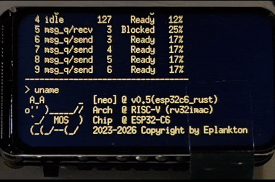

<h1 align="center">


</h1>

<h3 align="center">

<a href="https://github.com/Eplankton/mos-stm32/stargazers"></a>
<a href="https://github.com/Eplankton/mos-stm32/network/members"></a>
<a href="https://github.com/Eplankton/mos-stm32/contributors"></a>
<a href="https://github.com/Eplankton/mos-renode/commits"></a>

**[中文](https://gitee.com/Eplankton/mos-renode) | [English](https://github.com/Eplankton/mos-renode)**

</h3>

> [!NOTE]  
> This project is currently under actively developing and improving, some APIs and interfaces may change as the design continues to mature.

## About 🚀

- **MOS** is a Real-Time Operating System (RTOS) project built in C++/Rust, which consists of a preemptive kernel and a command-line shell with other applications (e.g., **GuiLite** and **FatFS**).

- [**Renode**](https://renode.io/) is a virtual development tool created by [**Antmicro**](https://antmicro.com/) for multi-node embedded networks (both wired and wireless) and is intended to enable a scalable workflow for creating effective, tested and secure IoT systems.


## Repository 🌏
- `mos-rust` - A "Vibe Coding" Chimera, check **[here](https://github.com/Eplankton/mos-rust)**.

- `mos-core` - The Kernel and the Shell, check **[here](https://github.com/Eplankton/mos-core)**.
- `mos-stm32` - Running on STM32 series, check **[here](https://github.com/Eplankton/mos-stm32)**.
- `mos-renode` - Test on Renode emulation, check **[here](https://github.com/Eplankton/mos-renode)**.

## Boot Up ⚡
<p align="center">

</p>

## Milestone 🧾

📦 `v0.5`

> ✅ Done：
>
> - **[Experimental]** Port to `ESP32-C6(RISC-V)`, Add BLE support
> - **[Experimental]** Rewrite it in Rust

📦 `v0.4`

> ✅ Done：
>
> - Add Hardware `FPU` support
> - **CMake Tools** are now available for compiling the project
> - Add external library [**ETL**](https://www.etlcpp.com/), a C++ template library for embedded applications
> - Add `Renode` emulation platform, add stable support for `Cortex-M` series
> - **[Experimental]** Add scheduler lock `Scheduler::suspend()`
> - **[Experimental]** Add Asynchronous stackless coroutines `Async::{Executor, Future_t, co_await/yield/return}`
>
> 📌 Planned: 
>
> - Shift from `FatFS` to `LittleFS`

📦 `v0.3`

> ✅ Done:
>
> - Mapping `Tids` to `BitMap_t`
> - Message queue `IPC::MsgQueue_t`
> - `Task::create` allows generic function signatures as `void fn(auto argv)` with type checker
> - Add `ESP32-C3` as a `WiFi` component
> - Add `Driver::Device::SD_t`, `SD` card driver, porting `FatFs` file system
> - Add `Shell::usr_cmds` for user-registered commands
> - **[Experimental]** Atomic types `<stdatomic.h>`
> - **[Experimental]** `Utils::IrqGuard_t`, nested interrupt critical sections
> - **[Experimental]** Simple formal verification of `Scheduler + Mutex`
>
> 📌 Planned: 
>
> - Inter-Process Communication: pipes/channels
> - `FPU` hardware float support
> - Performance benchmarking
> - Error handling with `Result<T, E>`, `Option<T>`
> - `DMA_t` DMA Driver
> - Software/hardware timers `Timer`
> - **[Experimental]** Adding `POSIX` support
> - **[Experimental]** More real-time scheduling algorithms


📦 `v0.2`

> ✅ Done:
> 
> - Synchronization primitives `Sync::{Sema_t, Lock_t, Mutex_t<T>, CondVar_t, Barrier_t}`
> - `Scheduler::Policy::PreemptPri` with `RoundRobin` scheduling for same priority levels
> - `Task::terminate` implicitly called upon task exit to reclaim resources
> - Simple command-line interaction `Shell::{Command, CmdCall, launch}`
> - `HAL::STM32F4xx::SPI_t` and `Driver::Device::ST7735S_t`, porting the `GuiLite` graphics library
> - Blocking delay with `Kernel::Global::os_ticks` and `Task::delay`
> - Refactored project organization into `{kernel, arch, drivers}`
> - Support for `GCC` compilation, compatible with `STM32Cube HAL`
> - Real-time calendar `HAL::STM32F4xx::RTC_t`, `CmdCall::date_cmd`, `App::Calendar`
> - `idle` uses `Kernel::Global::zombie_list` to reclaim inactive pages
> - Three basic page allocation policies `Page_t::Policy::{POOL, DYNAMIC, STATIC}`


📦 `v0.1`

> ✅ Done:
> 
> - Basic data structures, scheduler, and task control, memory management
>
> 📌 Planned: 
> 
> - Timers, round-robin scheduling
> - Inter-Process Communication (IPC), pipes, message queues
> - Process synchronization (Sync), semaphores, mutexes
> - Design a simple Shell
> - Variable page sizes, memory allocator
> - SPI driver, porting GuiLite/LVGL graphics libraries
> - Porting to other boards/arch, e.g., ESP32-C3 (RISC-V)


## References 🛸
- [How to build a Real-Time Operating System(RTOS)](https://medium.com/@dheeptuck/building-a-real-time-operating-system-rtos-ground-up-a70640c64e93)
- [PeriodicScheduler_Semaphore](https://github.com/Dungyichao/PeriodicScheduler_Semaphore)
- [STM32F4-LCD_ST7735s](https://github.com/Dungyichao/STM32F4-LCD_ST7735s)
- [A printf/sprintf Implementation for Embedded Systems](https://github.com/mpaland/printf)
- [GuiLite](https://github.com/idea4good/GuiLite)
- [STMViewer](https://github.com/klonyyy/STMViewer)
- [FatFs](http://elm-chan.org/fsw/ff)
- [The Zephyr Project](https://www.zephyrproject.org/)
- [Eclipse ThreadX](https://github.com/eclipse-threadx/threadx)
- [Embassy](https://embassy.dev/)
- [Renode](https://renode.io/)
- [Embedded Template Library (ETL)](https://www.etlcpp.com)
---

<p align="center">


</p>

```plain
🖖 Live Long and Prosper.
```